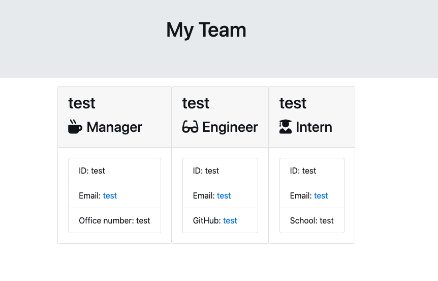

# TEAM PROFILE GENERATOR

### PURPOSE:
This is a Node CLI app that takes in information about employees and generates an HTML webpage that displays summaries for each person. It prompts a user to input information about a team manager and then information about team members. The user can input any number of team members, and they may be a mix of engineers and interns. When the user has completed building the team, the application will create an HTML file that displays a nicely formatted team roster based on the information provided by the user. 

### USAGE:
Use this application when you need to add an employee to your program.   [Here](https://drive.google.com/file/d/1G5aj6v3ihdUBxgwAur5i7TMV1Ihs4KLf/view?usp=sharing "Link to video showing how to use this app") is a short video showing how to use this application. [Here](https://github.com/maxonemillion/team-profile-generator "Link to github repository") is the Github repository for this project.

### Run:

### Generated HTML:

### CONTACT:
* max.daniel@utah.edu
* [LinkedIn](https://www.linkedin.com/in/maximilian-daniel1/ "Link to LinkedIn page")
* [Github](https://github.com/maxonemillion "Link to Github page")

